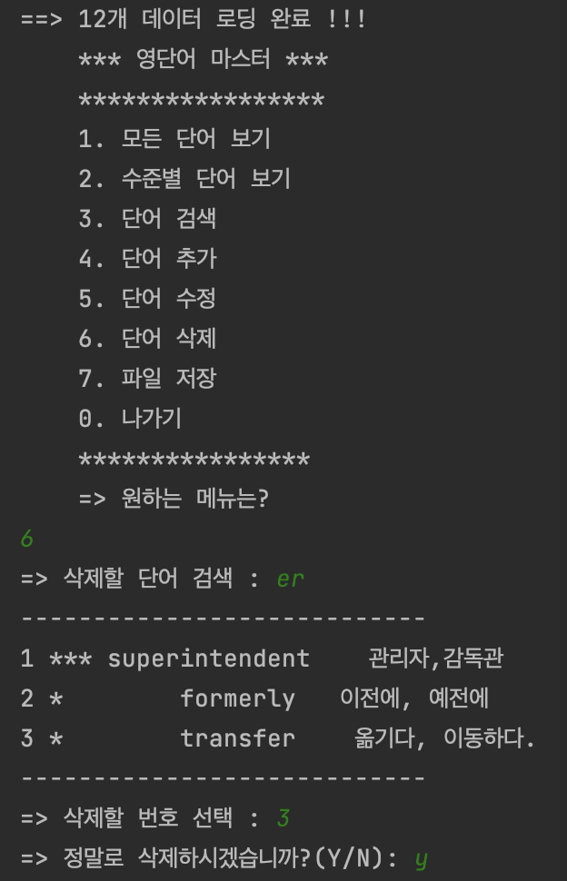

# WordMaster

## Java, IntelliJ IDEA, Maven

  

## 1.모든단어보기

  

## 2. 수준별 단어보기

  

## 3. 단어 검색

  

"ss"를 포함한 단어를 검색하였습니다.

## 4.단어추가

  

## 5. 단어 수정

  

"er"을 포함한 단어를 선택하였고, 뜻을 수정하였습니다.

  

단어 검색을 통해 , 해당 뜻이 변경 되었음을 확인 할 수 있었습니다.

## 6. 단어 삭제

  

"er"을 포함한 단어를 선택하였고, 그 중 transfer 단어를 삭제하였습니다.

  

list에서 단어를 찾아본 결과 단어가 삭제 되었음을 확인할 수 있었습니다.

## 7. 파일 저장

  

jump라는 단어를 추가해 주었습니다.

  

데이터를 저장하였습니다.

  

데이터가 Dictionary.txt에 저장된 것을 확인할 수 있습니다.  "|" 으로 구분되는 포맷으로 저장 되었습니다.

## 프로그램을 새로 실행하면 모든 단어를 정상적으로 잘 가져오는가? [file I/O 검사]

## 0.나가기

  

### * 소감
이전에 배웠던 CRUD를 다시 함으로써 익숙해져가는 과정임을 느꼈다. 

개발환경을 다루고, github을 다룸에 있어서 좋은 경험을 했던 것 같다.

### * 어려움
의외로 다른 리드미 파일에 , img 파일 연결하는 부분에서 애를 먹었다. 사지 파일이 한글로 작성되어 있으면 ,연결이 안되는 것을 깨달았다.

### * 건의사항
건의사항은 따로 없습니다.

